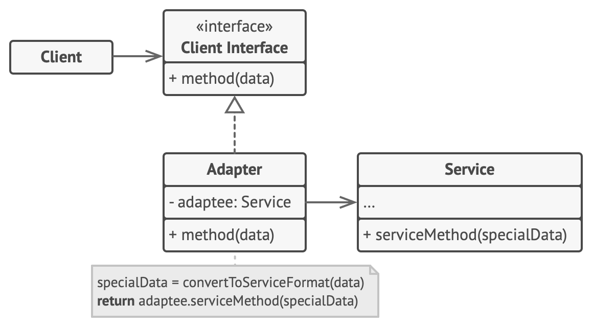
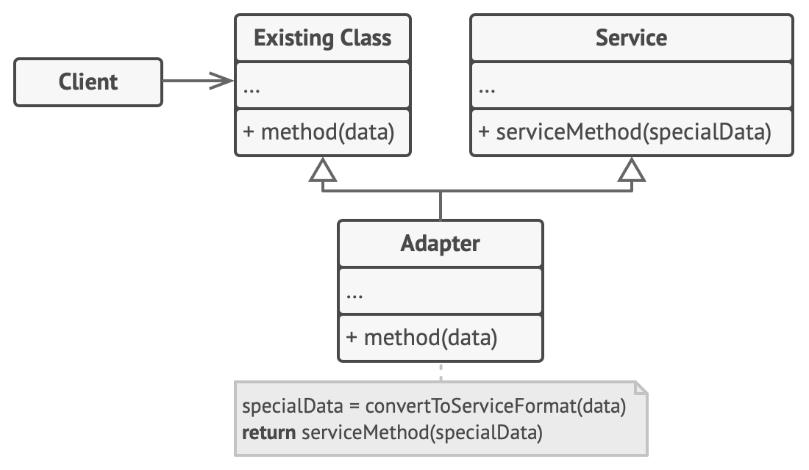

## Adapter Design Pattern (aka Wrapper)
- Adapter is a structural design pattern that allows objects with incompatible interfaces to collaborate.
Example - We have an existing object which provides the functionality that client needs. But the client code can't use this object because it expects an object with different interface.
- Problem: Suppose you are building a stock market monitoring app and you get all your data in xml format. Now you need to show good looking charts to end user and for that you decided to use a thord party library but that library accepts the data in JSON format.
- Solution: You can create an adapter which converts XML data to JSON data and then pass this to your third party library for charts.

### Implementation considerations
- Adapter must implement the interface expected by client.
- **Class Adapter** : 
  - This implementation uses inheritance: the adapter inherits interfaces from both objects at the same time.
  - We are simply going to forward the method to another method inherited from adaptee.
  - This approach can only be implemented in programming languages that support multiple inheritance. (Java supports multiple inheritance using types i.e., interfaces)
- **Object Adapter** : 
  - This implementation uses the object composition principle: the adapter implements the interface of one object and wraps the other one. 
  - Here, we are only going to implement target interface and accept adaptee as constructor argument in adapter.
  - It can be implemented in all popular programming languages.
  - This is more widely used as compared to Class Adapter.

### UML Diagrams

1. #### Object Adapter

2. #### Class Adapter

