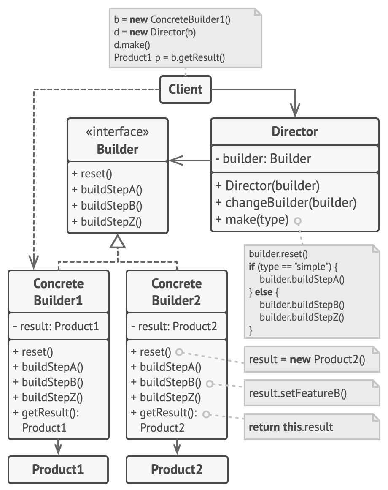

## Builder Design Pattern

Builder is a creational design pattern that lets you construct complex objects step by step. \
This pattern allows you to produce different types and representations of an object using the same construction code.

### Problem
- Imagine that there is a product (a product in ecommerce website like amazon) class.
- A product will have images of product, price, discount, product category/sub-category, product description, other product attributes (size variant, color, brand, etc).
- All of this will result into product class having a monstrous constructor with lots of parameters.
- In most cases most of the parameters will be unused, making the constructor calls pretty ugly. For instance, only a fraction of products will have size option or discount at a particular time.

### Solution
- The Builder pattern suggests that you extract the object construction code out of its own class and move it to separate objects called builders.\
Ex - For the above case, we build the product object in multiple stages.
- The important part is that you don’t need to call all the steps. You can call only those steps that are necessary for producing a particular configuration of an object.

### Director
- The director class defines the order in which to execute the building steps, while the builder provides the implementation for those steps.
- we can always call the building steps in a specific order directly from the client code. However, the director class might be a good place to put various construction routines so you can reuse them across your program.
- the director class completely hides the details of product construction from the client code. The client only needs to associate a builder with a director, launch the construction with the director, and get the result from the builder.

### UML Diagram

