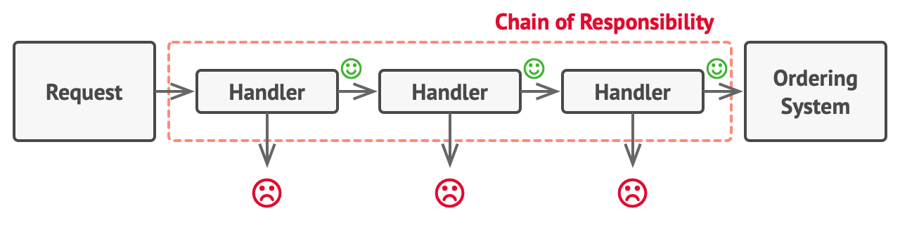

## Chain Of Responsibility Design Pattern
- Chain of Responsibility is a behavioral design pattern that lets you pass requests along a chain of handlers. Upon receiving a request, each handler decides either to process the request or to pass it to the next handler in the chain.
- **Problem** : Imagine you have a system where you are passing requests to order something (food, products, etc). 
Now you want to add a handler to check if user is authenticated or not. \
After sometime, you add another check of the request coming to you is in JSON format or not. \
After sometime, you add another handler to check if the user is admin or not. If the user is admin, he/she can do things for which only an admin will have access. \
Now if you keep all this logic inside a single handler, you code becomes messy, large and is not reusable.
- **Solution** : Now, if you transform each functionality into it's own handler you end up with clean and reusable code. \
Also, each handler will have it's own functionality. If request format is correct then check if user is authenticated or not. If user is authenticated then check whether user is admin or not.

- **Chain of Responsibility** relies on transforming particular behaviors into stand-alone objects called handlers.
- Every handler has it's own responsibility and after completing that if can decide whether it needs to pass the request to next handler in the chain or not.

### UML 

