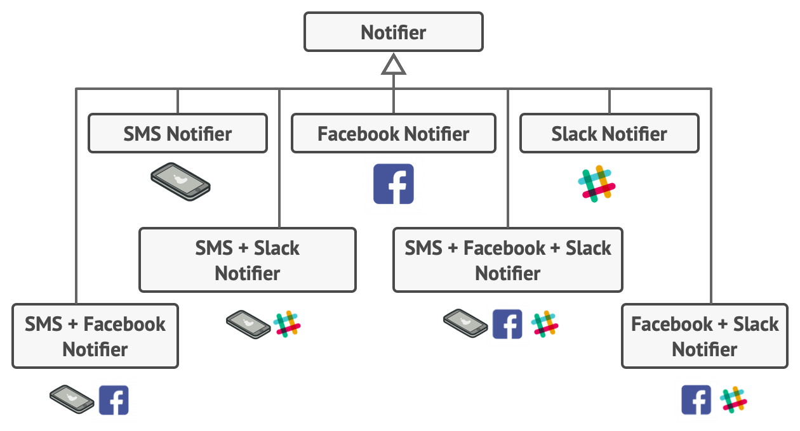
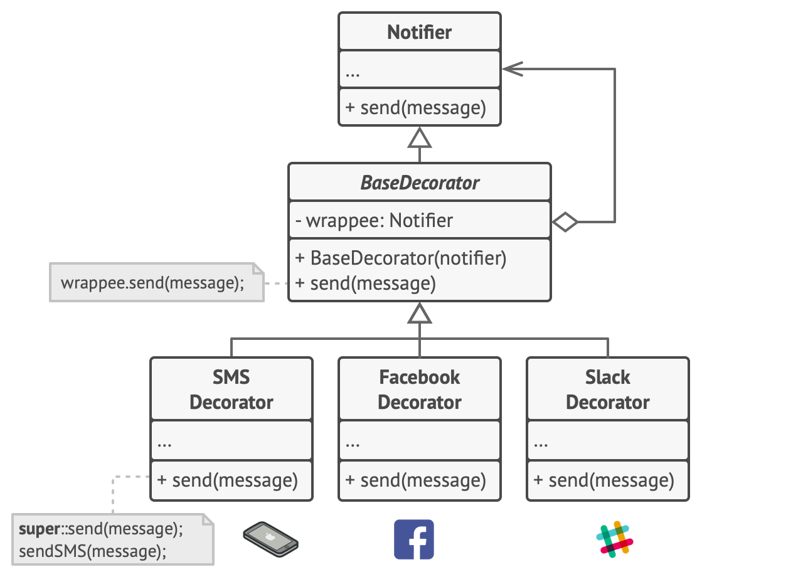
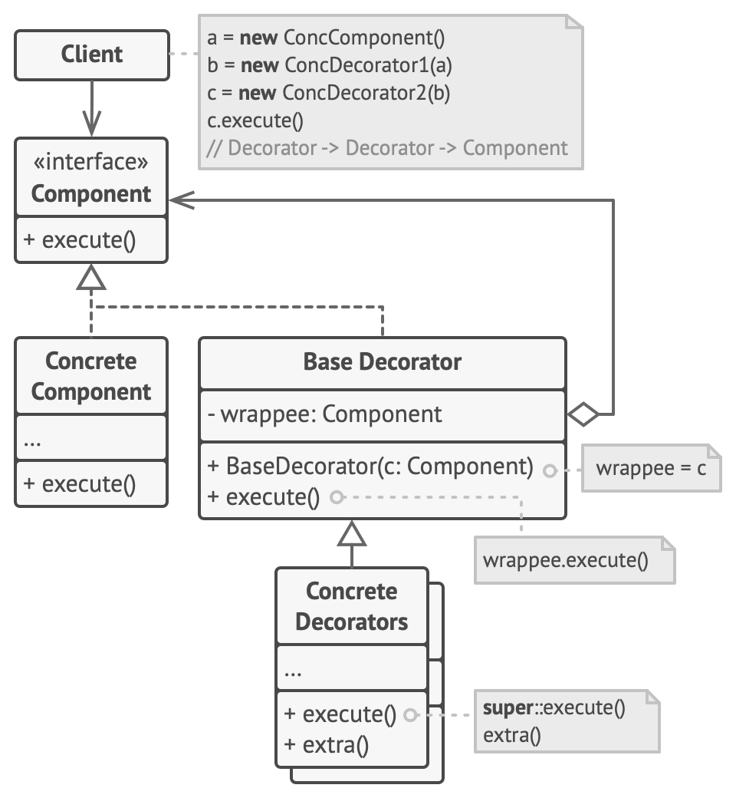

## Decorator Design Pattern
- Decorator is a structural design pattern that lets you attach new behaviors to objects by placing these objects inside special wrapper objects that contain the behaviors.
- **Problem** : Suppose you have a notification system in place which sends a email notification. Now, you get another feature that you want to send notifications to facebook, slack, sm, etc also. 
Also, keep in mind that there can be different combination between them as well like you want to send facebook + instagram notification at once and sms only in case of important notification and all notifications (sms + email + facebook + instagram) in case of emergency.
To solve this, we extend notifier class and keep on adding new additional notification methods. and for sending combination of notifications, we tried to address that problem by creating special subclasses which combined several notification methods within one class.
However, it quickly became apparent that this approach would bloat the code immensely, not only the library code but the client code as well.

- **Solution**: We solve the above problem by creating a base decorator which sends a default notification and turn all other notification methods into decorators.

- Decorator wraps an object within itself and provided same interface as the wrapper object. So the client of original object doesn't need to change.
- A decorator provided alternative to subclassing for extending functionality of existing class.
- Decorators support recursive composition.
- Decorators are more flexible and powerful than inheritance. Inheritance is static by definition but decorators allows us to dynamically componse behaviour using objects at run time.

### Decorator UML Diagram

### Implementation Consideration
- Since we have decorators and concrete classes extending from the common component, avoid large state in this base class as decorators may not need all that state.
- As decorators support recursive composition, so this pattern lends itself to creation of lots of small objects that add "just a little bit" functionality. Code using these objects becomes difficult to debug.
- Decorators should add helpful small behaviours to object's original behaviour and should not change meaning of operations itself.

### Applicability
- Use the Decorator pattern when you need to be able to assign extra behaviors to objects at runtime without breaking the code that uses these objects.
- Use the pattern when it’s awkward or not possible to extend an object’s behavior using inheritance.

### Pros and Cons

|                                                                         Pros                                                                          |                                                            Cons                                                            |
|:-----------------------------------------------------------------------------------------------------------------------------------------------------:|:--------------------------------------------------------------------------------------------------------------------------:|
|                                          You can extend an object’s behavior without making a new subclass.                                           | It’s hard to remove a specific wrapper from the wrappers stack. |
|                                           You can add or remove responsibilities from an object at runtime.                                           | It’s hard to implement a decorator in such a way that its behavior doesn’t depend on the order in the decorators stack. |
|                                   You can combine several behaviors by wrapping an object into multiple decorators.                                   | The initial configuration code of layers might look pretty ugly. |
| *Single Responsibility Principle*. You can divide a monolithic class that implements many possible variants of behavior into several smaller classes. ||

