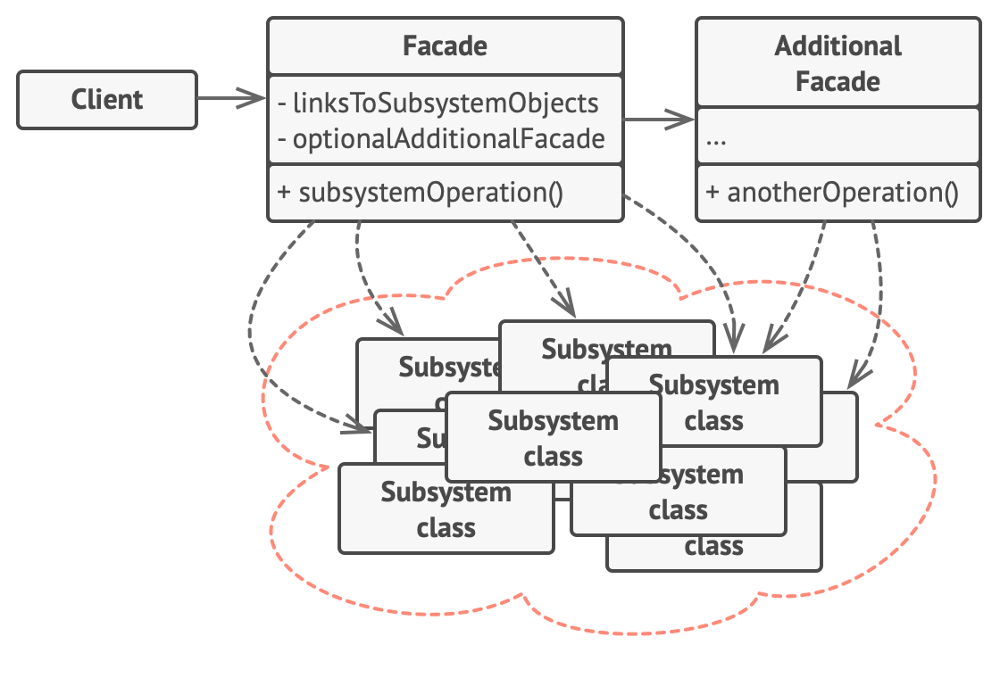

## Facade Design Pattern
- Facade is a structural design pattern that provides a simplified interface to a library, a framework, or any other complex set of classes.
- **Problem**: Imagine you have to interact with a large number of interfaces and classes in a subsystem to get your result. So, client gets tightly coupled with those interfaces and classes.
- **Solution**: Facade provides a simple and unified interface to a subsystem. Client interacts with just the facade now to get the same result
- Facade is a great solution to simplfy dependencies. It allows yo have a weak coupling between subsystem.

### UML Digaram

### Implementation consideration
- A facade should minimize the complexity of subsystem and provide usable interface
- you can have a interface or abstract class for facase and client can use different subclasses to talk to different subsystem implementation.
- A facade is not replacement for regular usage of classes in subsystem. your subsystem class implementations should not make assumptions of usage of facase by client code.

### Apllicability
- Use the Facade pattern when you need to have a limited but straightforward interface to a complex subsystem.
- Use the Facade when you want to structure a subsystem into layers.

### Pros and Cons

|                Pros                |                                                            Cons                                                            |
|:----------------------------------:|:--------------------------------------------------------------------------------------------------------------------------:|
| You can isolate your code from the complexity of a subsystem.| A facade can become a god object coupled to all classes of an app. |
