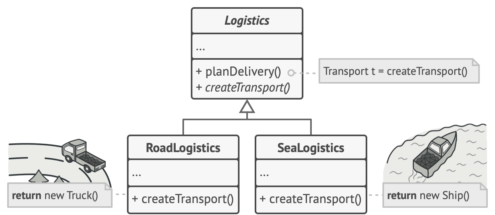
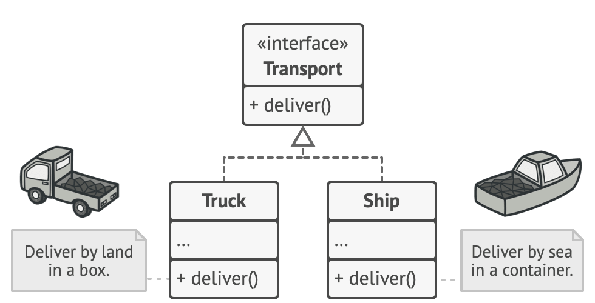
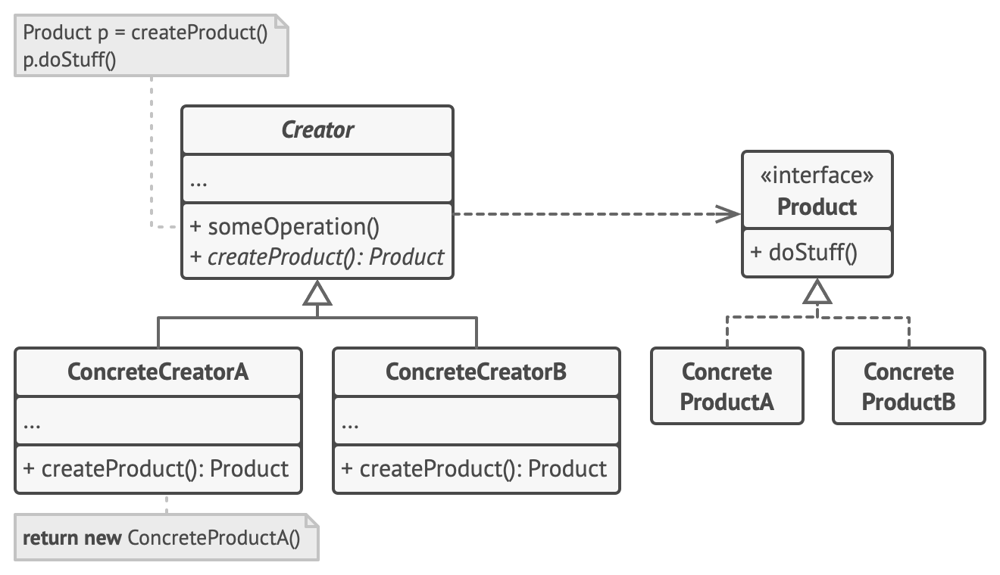

## Factory Design Pattern (Also known as: Virtual Constructor)
- Factory Method is a creational design pattern that provides an interface for creating objects in a superclass, but allows subclasses to alter the type of objects that will be created.

### Problem
- Imagine that you’re creating a logistics management application. The first version of your app can only handle transportation by trucks, so the bulk of your code lives inside the Truck class.
- After a while, your app becomes pretty popular. Each day you receive dozens of requests from sea transportation companies to incorporate sea logistics into the app.
- At present, most of your code is coupled to the Truck class. Adding Ships into the app would require making changes to the entire codebase. Moreover, if later you decide to add another type of transportation to the app, you will probably need to make all of these changes again.

### Solution
- The Factory Method pattern suggests that you replace direct object construction calls (using the new operator) with calls to a special factory method. Objects returned by a factory method are often referred to as products.

- There’s a slight limitation though: subclasses may return different types of products only if these products have a common base class or interface. Also, the factory method in the base class should have its return type declared as this interface.

- For example, both Truck and Ship classes should implement the Transport interface, which declares a method called deliver. Each class implements this method differently: trucks deliver cargo by land, ships deliver cargo by sea. The factory method in the RoadLogistics class returns truck objects, whereas the factory method in the SeaLogistics class returns ships.

### Factory UML Diagram

### Implementation Consideration
- Make all products follow the same interface. This interface should declare methods that make sense in every product.
- Add an empty factory method inside the creator class. The return type of the method should match the common product interface.
- In the creator’s code find all references to product constructors. One by one, replace them with calls to the factory method, while extracting the product creation code into the factory method.
- Now, create a set of creator subclasses for each type of product listed in the factory method. Override the factory method in the subclasses and extract the appropriate bits of construction code from the base method.
- If there are too many product types and it doesn’t make sense to create subclasses for all of them, you can reuse the control parameter from the base class in subclasses.

    For instance, imagine that you have the following hierarchy of classes: the base Mail class with a couple of subclasses: AirMail and GroundMail; the Transport classes are Plane, Truck and Train. While the AirMail class only uses Plane objects, GroundMail may work with both Truck and Train objects. You can create a new subclass (say TrainMail) to handle both cases, but there’s another option. The client code can pass an argument to the factory method of the GroundMail class to control which product it wants to receive.

- If, after all of the extractions, the base factory method has become empty, you can make it abstract. If there’s something left, you can make it a default behavior of the method.

### Applicability
- Use the Factory Method when you don’t know beforehand the exact types and dependencies of the objects your code should work with.
- Use the Factory Method when you want to provide users of your library or framework with a way to extend its internal components.
- Use the Factory Method when you want to save system resources by reusing existing objects instead of rebuilding them each time.

### Pros and Cons

|                                                                         Pros                                                                          |                                                            Cons                                                            |
|:-----------------------------------------------------------------------------------------------------------------------------------------------------:|:--------------------------------------------------------------------------------------------------------------------------:|
|                                           You avoid tight coupling between the creator and the concrete products.                                           | The code may become more complicated since you need to introduce a lot of new subclasses to implement the pattern. The best case scenario is when you’re introducing the pattern into an existing hierarchy of creator classes. |
|                                           Single Responsibility Principle. You can move the product creation code into one place in the program, making the code easier to support.                                          |  |
|                                   Open/Closed Principle. You can introduce new types of products into the program without breaking existing client code.                             |  |

