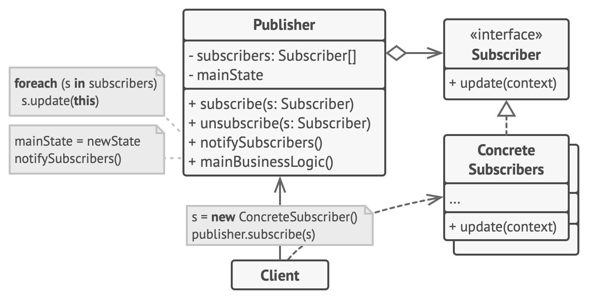

## Observer Design Pattern (aka Pub-Sub)
- Observer is a behavioral design pattern that lets you define a subscription mechanism to notify multiple objects about any events that happen to the object they’re observing.
- **Problem**: Imagine you have a new iphone launch which will happen in upcoming weeks, so you want all interested people to know when that iphone is available through an email.
- **Solution**: The Observer pattern suggests that you add a subscription mechanism to the publisher so individual objects can subscribe to or unsubscribe from a stream of events coming from that publisher.
- Observer Provides one to many relationship between objects.

### UML Diagram

### Implementation Considerations
- We define an interface for an observer. Observer is usually a simple interface and defines a method used by subject to notify about state changes.
- Subject can be an interface if we are expecting observers to listen to multiple objects or else subject can be any concrete class.
- Implementing subject means taking care of handling attach (subscribe), detach (unsubscribe) of observers, notifying all registered observers and providing methods to provide state information requested by observers.
- Concrete Observers use a reference passed to them to call subject for getting more information about the state. If we are passing changed state in notify method then this is not required.

### Applicability
- Use the Observer pattern when changes to the state of one object may require changing other objects, and the actual set of objects is unknown beforehand or changes dynamically.
- Use the Observer pattern when some objects in your app must observe others, but only for a limited time or in specific cases.

### Pros and Cons
|                                                                                Pros                                                                                |                                                            Cons                                                            |
|:------------------------------------------------------------------------------------------------------------------------------------------------------------------:|:--------------------------------------------------------------------------------------------------------------------------:|
| *Open/Closed Principle*. You can introduce new subscriber classes without having to change the publisher’s code (and vice versa if there’s a publisher interface). |Subscribers are notified in random order.|
|                                                      You can establish relations between objects at runtime.                                                       ||

### References
- **Publisher**: The object that has some interesting state is often called subject, but since it’s also going to notify other objects about the changes to its state, we’ll call it publisher.
- **Subscriber**: All other objects that want to track changes to the publisher’s state are called subscribers.

 