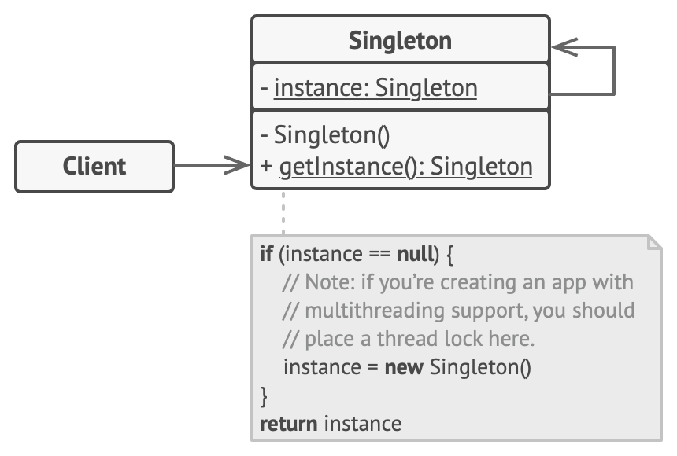

## Singleton Design Pattern
- Singleton is a creational design pattern that lets you ensure that a class has only one instance, while providing a global access point to this instance.
- Main Problem this pattern solves is to ensure that only a single instance of this class exists
- Any state you add in your singleton, becomes part of "global state" of your application

### UML diagram

### Implementation Consideration
1. Controlling instance creating
   1. Class constructor must not be accessible globally
   2. Subsclassing/inheritance must not be allowed
2. Keeping tract of instance
   1. Class itself is a good place to keep track of instance
3. Giving access to the singleton instance
   1. A public static method is a good choice
   2. Can expose instance as final public static field but it won't work for all singletom implementations.
4. Two options for implementing a singleton
   1. Eager Singleton : Create a singleton as soon as class is loaded
   2. Lazy Singleton: Create a singleton when it is first required
 