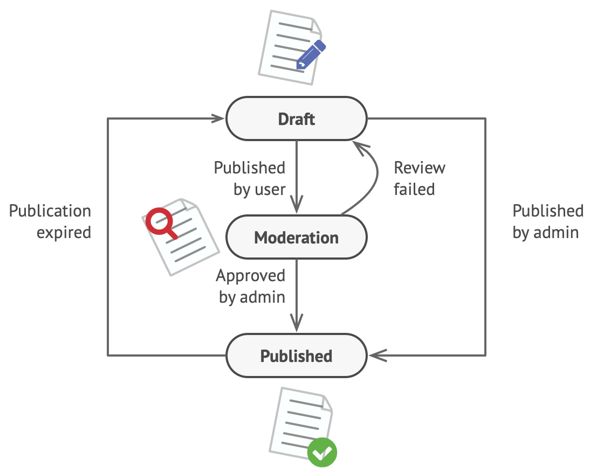
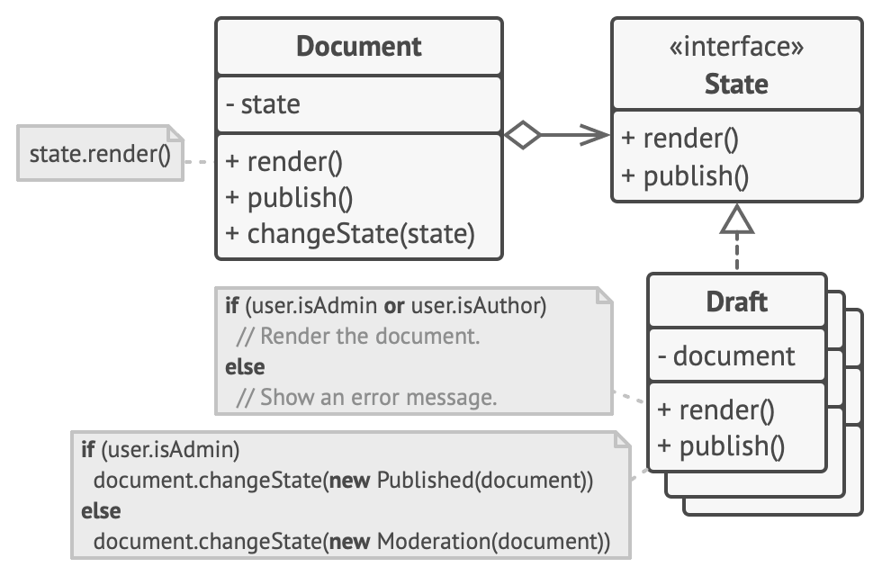
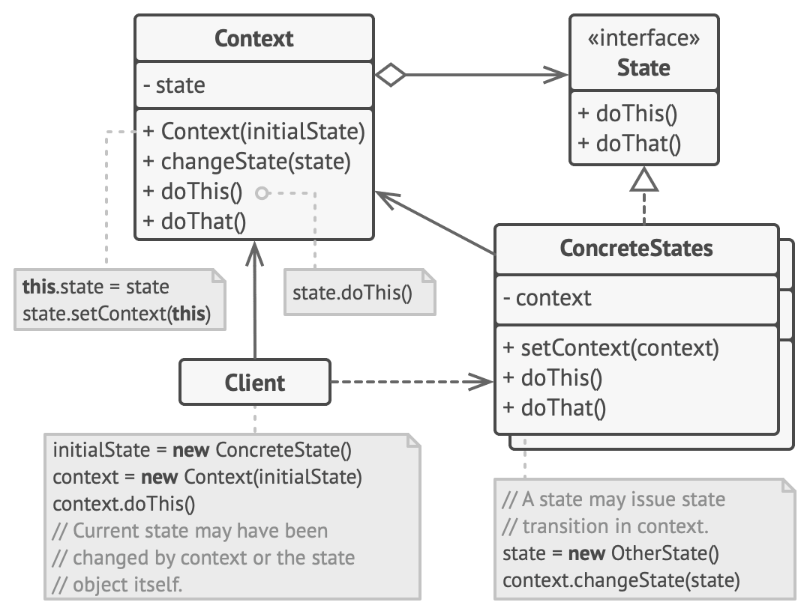

## State Design Pattern
- State is a behavioral design pattern that lets an object alter its behavior when its internal state changes. It appears as if the object changed its class.

### Problem
- The main idea is that, at any given moment, there’s a finite number of states which a program can be in. Within any unique state, the program behaves differently, and the program can be switched from one state to another instantaneously. However, depending on a current state, the program may or may not switch to certain other states. These switching rules, called transitions, are also finite and predetermined.
- You can also apply this approach to objects. Imagine that we have a Document class. A document can be in one of three states: Draft, Moderation and Published. The publish method of the document works a little bit differently in each state:
    - In Draft, it moves the document to moderation.
    - In Moderation, it makes the document public, but only if the current user is an administrator.
    - In Published, it doesn’t do anything at all.

### Solution
- The State pattern suggests that you create new classes for all possible states of an object and extract all state-specific behaviors into these classes.
- Instead of implementing all behaviors on its own, the original object, called context, stores a reference to one of the state objects that represents its current state, and delegates all the state-related work to that object.
- To transition the context into another state, replace the active state object with another object that represents that new state. This is possible only if all state classes follow the same interface and the context itself works with these objects through that interface.
- This structure may look similar to the Strategy pattern, but there’s one key difference. In the State pattern, the particular states may be aware of each other and initiate transitions from one state to another, whereas strategies almost never know about each other.

### State UML Diagram

### Applicability
- Use the State pattern when you have an object that behaves differently depending on its current state, the number of states is enormous, and the state-specific code changes frequently.
- Use the pattern when you have a class polluted with massive conditionals that alter how the class behaves according to the current values of the class’s fields.
- Use State when you have a lot of duplicate code across similar states and transitions of a condition-based state machine.

### Implementation Consideration
- Decide what class will act as the context. It could be an existing class which already has the state-dependent code; or a new class, if the state-specific code is distributed across multiple classes.
- Declare the state interface. Although it may mirror all the methods declared in the context, aim only for those that may contain state-specific behavior.
- For every actual state, create a class that derives from the state interface. Then go over the methods of the context and extract all code related to that state into your newly created class.
- In the context class, add a reference field of the state interface type and a public setter that allows overriding the value of that field.
- Go over the method of the context again and replace empty state conditionals with calls to corresponding methods of the state object.
- To switch the state of the context, create an instance of one of the state classes and pass it to the context. You can do this within the context itself, or in various states, or in the client. Wherever this is done, the class becomes dependent on the concrete state class that it instantiates.

### Pros & Cons
|Pros | Cons |
|:-----------------------------------------------------------------------------------------------------------------------------------------------------:|:--------------------------------------------------------------------------------------------------------------------------:|
|  Single Responsibility Principle. Organize the code related to particular states into separate classes. | Applying the pattern can be overkill if a state machine has only a few states or rarely changes. |
| Open/Closed Principle. Introduce new states without changing existing state classes or the context. |  |
| Simplify the code of the context by eliminating bulky state machine conditionals. |  |

