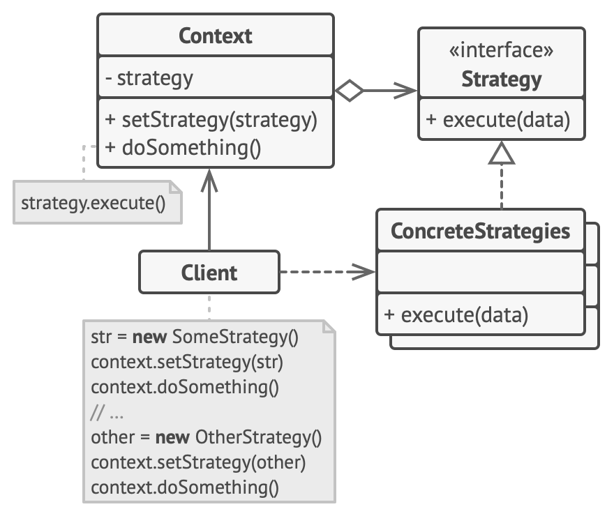

## Strategy Design Pattern
- Strategy is a behavioral design pattern that lets you define a family of algorithms, put each of them into a separate class, and make their objects interchangeable.
- **Problem**: You are creating a service to send some report to your user. Initially in the first release you only supported download now feature and you added this feature inside your ReportService class.\
Now in the next, release you need to support the feature to send this report to an email, you added this method in your report service.\
In next release, again you need to add support to send report to sms in different format and again you added this method in your report service.\
At this point you see that your report service is growing and it contains a lot of code to just print/send/download report.
- **Solution**: The strategy pattern suggest that you create different classes just to send report to email/sms/download and you define this new strategy in your report service. \
All this classes will implement a common interface to main the consistency.

### Strategy UML diagram

### Implement Considerations
- The original class, called context, must have a field for storing a reference to one of the strategies. The context delegates the work to a linked strategy object instead of executing it on its own.
- We can implement our context in a way where strategy object is optional. This makes context usable for client codes who do not want to deal with concrete strategy objects.

### Applicability
- Use the Strategy pattern when you want to use different variants of an algorithm within an object and be able to switch from one algorithm to another during runtime.
- Use the Strategy when you have a lot of similar classes that only differ in the way they execute some behavior.
- Use the pattern to isolate the business logic of a class from the implementation details of algorithms that may not be as important in the context of that logic.
- Use the pattern when your class has a massive conditional statement that switches between different variants of the same algorithm.

### Pros and Cons
|                                              Pros                                               |                                                                                                                         Cons                                                                                                                          |
|:-----------------------------------------------------------------------------------------------:|:-----------------------------------------------------------------------------------------------------------------------------------------------------------------------------------------------------------------------------------------------------:|
|                    You can swap algorithms used inside an object at runtime.                    | Since Client need to configures context object with appropriate stragtey object, clients know all about implementations of strategy which makes client and strategies tightly coupled.. Introducing new algorithms means changing client code as well |
|     You can isolate the implementation details of an algorithm from the code that uses it.      ||
|                          You can replace inheritance with composition.                          ||
| *Open/Closed Principle*. You can introduce new strategies without having to change the context. ||